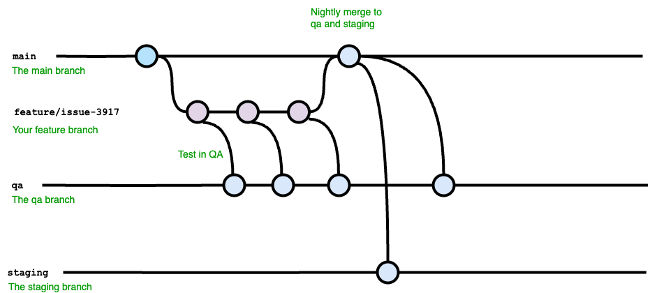

# Platform Apps - a catalogue of apps for Flux CD

This repository has the **specification** of Flux CD resources for different apps.

The *apps* directory contains sub directories with Flux CD Helm releases, charts and opinionated chart values.

## Development practices

- Test on feature branch in your sandbox.
- Raise a Pull Request to main branch
- Test main branch in QA.
- If successful in QA, create a tag and release from main branch using semantic versioning, like v1.2.3
- Minor and patch releases get automatic rollout to staging.
- Patch releases get automatic rollout to prod and standby.
- Major releases are rolled out manually through pull requests.



Look at [RELEASE.md](RELEASE.md) for the full process flow, rollback option and timeline.

## Usage

In order to implement the resources in this repository you need the following on your **implementation** side:

- kustomization.yaml

### platform-apps.yaml example

```yaml
---
apiVersion: source.toolkit.fluxcd.io/v1
kind: GitRepository
metadata:
  name: platform-apps-git
  namespace: flux-system
spec:
  interval: 1m0s
  ref:
    branch: main
  url: https://github.com/dfds/platform-apps
```

### kustomization.yaml example

This is a standard k8s Kustomization resource where we reference the specific app we want to install with Flux.
This will contain a link to the specific app under the apps folder; in this example *traefik*.

Optionally it can also contain a **patches** section that includes inline YAML, if we want to patch any of the Helm chart values.

```yaml
----
apiVersion: kustomize.config.k8s.io/v1beta1
kind: Kustomization
resources:
  - https://github.com/dfds/platform-apps/apps/traefik-blue-variant
```

### Terraform

In our setup we use the the <https://github.com/dfds/infrastructure-modules/tree/master/_sub/compute/k8s-traefik-flux> Terraform module to generate the kustomization.yaml files.
