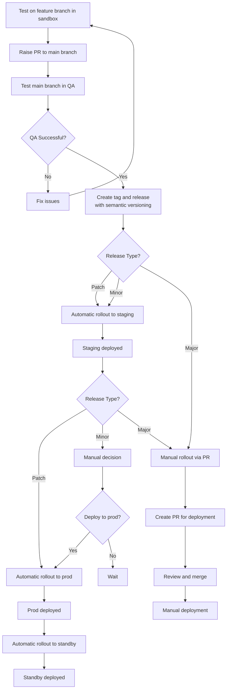
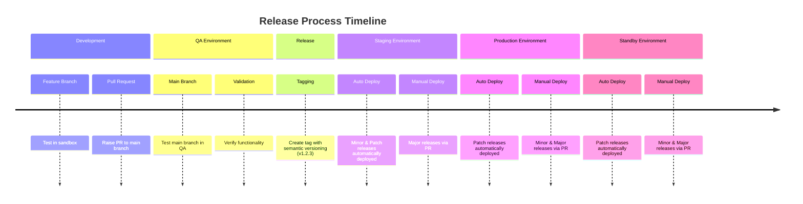

# Release process

## Process Steps

- Test on feature branch in your sandbox.
- Raise a Pull Request to main branch
- Test main branch in QA.
- If successful in QA, create a tag and release from main branch using semantic versioning, like v1.2.3
- Minor and patch releases get automatic rollout to staging.
- Patch releases get automatic rollout to prod and standby.
- Major releases are rolled out manually through pull requests.

## Process Flow

## Rollback process

- Delete faulty release and tag.
- If it was a major release, then rollback also needs to revert pull requests.
- Flux reconcile will pull in the previous tag.

## Process Timeline

