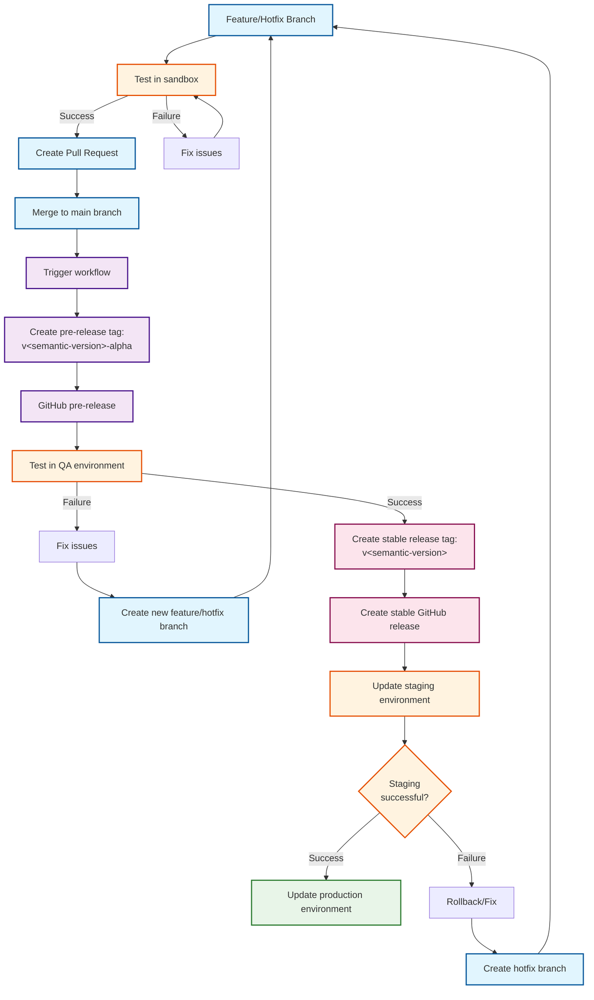
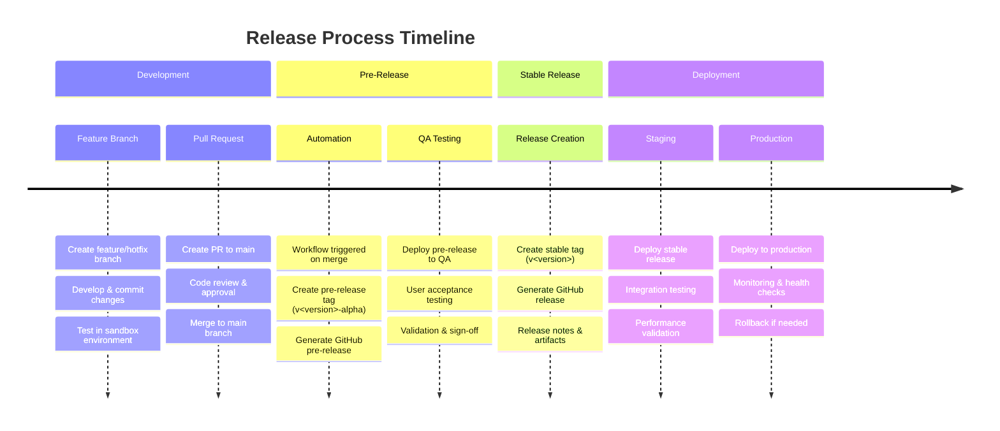

# Release process

## Process Details

- This repo has just one branch, which is the main branch.
- Changes to the main branch comes from pull requests.
- Feature branches and hotfix branches are tested in sandbox.
- Every merge to main branch trigger a workflow that creates a pre-release tag and a GitHub pre-release.
- Pre-release tags follow the naming standard v<semantic-version>-alpha.
- Pre-releases are tested in QA.
- It QA testing is successful, then create a stable release tag and a release version from the pre-release.
- Stable releases follow the naming standard v<semantic-version>.
- Update staging to use the latest stable release.
- If staging is successful, then update prod to use the latest stable release.

## Process Flow

## Release Timeline

