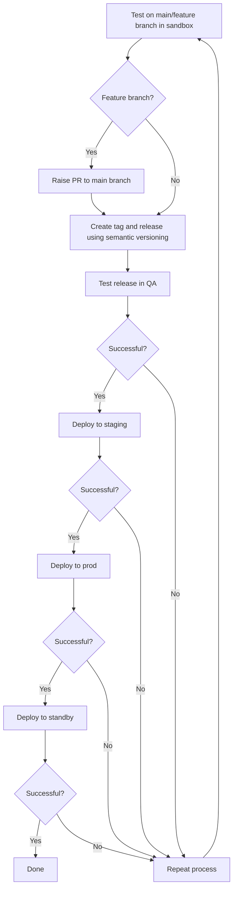
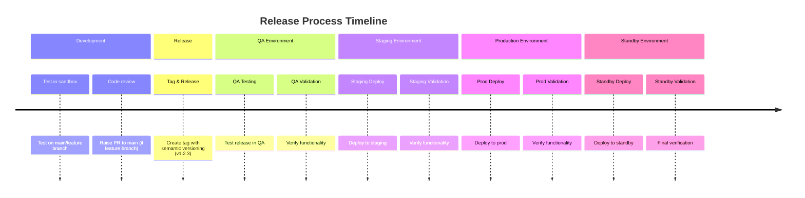

# Release process

## Process Steps

- Test on main branch (or feature branch) in your sandbox.
- Raise a Pull Request to main branch if you had a feature branch.
- Create a tag and release from main branch using semantic versioning, like v1.2.3
- Test release in QA.
- If successful in QA, deploy to staging.
- If successful in staging, deploy to prod.
- If successful in prod, deploy to standby.
- If any step is unsuccessful, repeat the process.

## Process Flow

## Process Timeline

