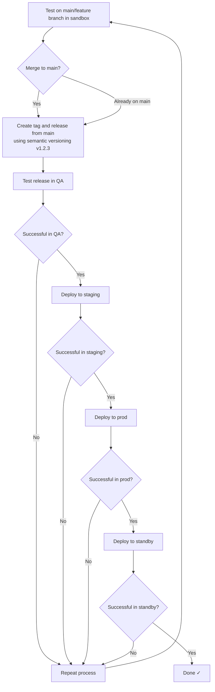
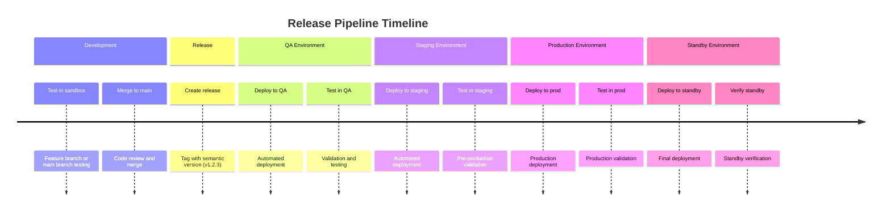

# Release process

## Process Flow

```mermaid
flowchart TD
    A[Test on main/feature branch in sandbox] --> B{Merge to main?}
    B -->|Yes| C[Create tag and release from main<br/>using semantic versioning v1.2.3]
    B -->|Already on main| C
    C --> D[Test release in QA]
    D --> E{Successful in QA?}
    E -->|No| F[Repeat process]
    E -->|Yes| G[Deploy to staging]
    G --> H{Successful in staging?}
    H -->|No| F
    H -->|Yes| I[Deploy to prod]
    I --> J{Successful in prod?}
    J -->|No| F
    J -->|Yes| K[Deploy to standby]
    K --> L{Successful in standby?}
    L -->|No| F
    L -->|Yes| M[Done ✓]
    F --> A
```

## Release Timeline

```mermaid
timeline
    title Release Pipeline Timeline
    section Development
        Test in sandbox : Feature branch or main branch testing
        Merge to main : Code review and merge
    section Release
        Create release : Tag with semantic version (v1.2.3)
    section QA Environment
        Deploy to QA : Automated deployment
        Test in QA : Validation and testing
    section Staging Environment
        Deploy to staging : Automated deployment
        Test in staging : Pre-production validation
    section Production Environment
        Deploy to prod : Production deployment
        Test in prod : Production validation
    section Standby Environment
        Deploy to standby : Final deployment
        Verify standby : Standby verification
```
